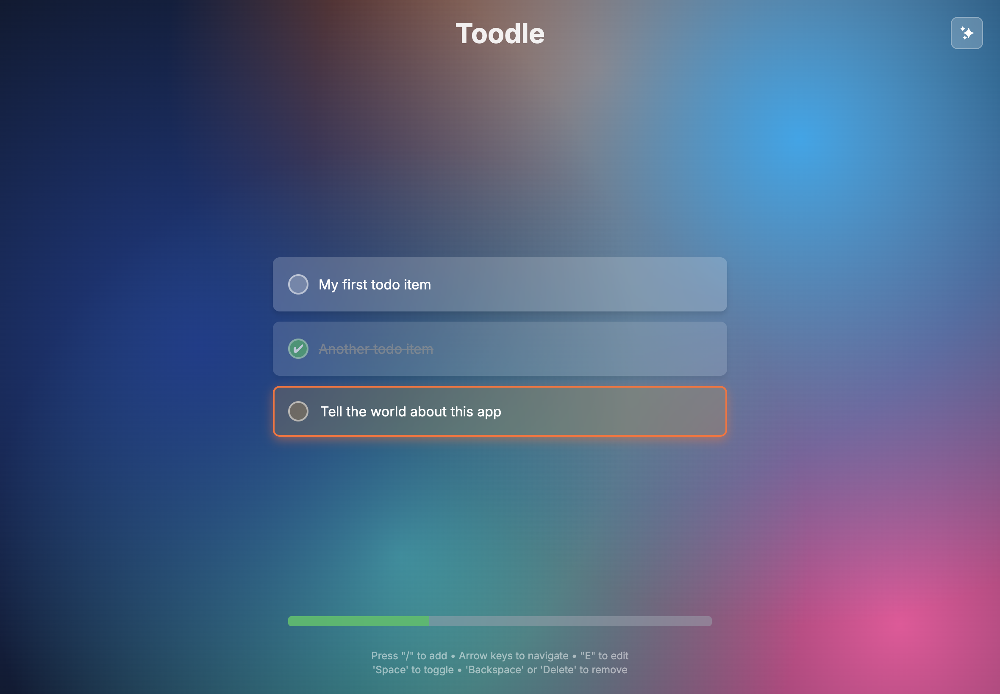

# Toodle

A modern, responsive todo list application built with React, TypeScript, Vite, and Tailwind CSS. All todo items are stored in the browser's local storage. The app is containerized with Docker and served using Caddy for production-ready deployment.



## Features

- ✅ Add, edit, and delete todos
- 🎨 Modern UI with Tailwind CSS
- 📱 Responsive design
- 🚀 Fast development with Vite
- 🐳 Docker containerization
- 🔒 HTTPS with automatic SSL certificates via Caddy
- ⚡ Built with Bun for speed
- 🧪 Entirely vibe-coded with [Opencode](https://opencode.ai/)

## Installation

### Prerequisites

- [Bun](https://bun.sh/) (recommended) or Node.js
- [Docker](https://www.docker.com/) (for containerized builds)

### Local Development

1. Clone the repository:
   ```bash
   git clone https://github.com/nicbet/toodle.git
   cd toodle
   ```

2. Install dependencies:
   ```bash
   bun install
   ```

3. Start the development server:
   ```bash
   bun run dev
   ```

4. Open [http://localhost:5173](http://localhost:5173) in your browser.

## Build

### Local Build

To build the project locally:

```bash
bun run build
```

This creates a `dist/` directory with the production build.

### Docker Build

To build and run with Docker:

```bash
make build
```

This will:
1. Run `bun run build` to create the production build
2. Build the Docker image `ghcr.io/nicbet/toodle:latest`

### Available Make Targets

- `make all` or `make build`: Build the Docker image
- `make clean`: Remove build artifacts and Docker image

## Deployment

The Docker image is configured to serve the app with Caddy, which supports two deployment modes:

### Mode 1: Automatic TLS (Default)
Caddy automatically handles:
- HTTPS certificates from Let's Encrypt
- HTTP to HTTPS redirection
- Static file serving with SPA routing

### Mode 2: Behind Load Balancer/Ingress
For deployments behind a load balancer, reverse proxy, or ingress controller that handles TLS termination.

## Deployment Examples

### Automatic TLS Mode (Default)

```bash
docker run -p 80:80 -p 443:443 -e APP_DOMAIN=yourdomain.com ghcr.io/nicbet/toodle:latest
```

### Behind Load Balancer Mode

```bash
docker run -p 5000:5000 -e APP_DOMAIN=yourdomain.com -e BEHIND_LOAD_BALANCER=true ghcr.io/nicbet/toodle:latest
```

You can customize the port using the `PORT` environment variable:

```bash
docker run -p 8080:8080 -e APP_DOMAIN=yourdomain.com -e BEHIND_LOAD_BALANCER=true -e PORT=8080 ghcr.io/nicbet/toodle:latest
```

### Docker Compose Examples

**Automatic TLS:**
```yaml
version: '3.8'
services:
  toodle:
    image: ghcr.io/nicbet/toodle:latest
    environment:
      - APP_DOMAIN=yourdomain.com
      - BEHIND_LOAD_BALANCER=false  # or omit (default)
    ports:
      - "80:80"
      - "443:443"
    volumes:
      - ./caddy_data:/data
      - ./caddy_config:/config
```

**Behind Load Balancer:**
```yaml
version: '3.8'
services:
  toodle:
    image: ghcr.io/nicbet/toodle:latest
    environment:
      - APP_DOMAIN=yourdomain.com
      - BEHIND_LOAD_BALANCER=true
      - PORT=5000  # Default port, can be customized
    ports:
      - "5000:5000"  # Map host port to container port
    # No need for Caddy data volumes when behind load balancer
```

**Custom Port Example:**
```yaml
version: '3.8'
services:
  toodle:
    image: ghcr.io/nicbet/toodle:latest
    environment:
      - APP_DOMAIN=yourdomain.com
      - BEHIND_LOAD_BALANCER=true
      - PORT=8080
    ports:
      - "8080:8080"
```

## Environment Variables

The application supports the following environment variables:

- `APP_DOMAIN`: The domain name for the application (default: `localhost`)
- `BEHIND_LOAD_BALANCER`: Set to `true` to run behind a load balancer/ingress (default: `false`)
- `PORT`: Port to bind to when running behind a load balancer (default: `5000`)

### Automated Setup with Script

For easy installation, use the provided setup script:

```bash
chmod +x setup
./setup
```

This interactive script will:
1. Prompt for installation path and domain
2. Ask if you're deploying behind a load balancer
3. Create a `docker-compose.yml` file with proper configuration
4. Set up environment files and volumes for Caddy data persistence (when using TLS mode)

## Contributing

We welcome contributions! Please follow these steps:

1. Fork the repository
2. Create a feature branch: `git checkout -b feature/your-feature`
3. Make your changes
4. Run tests: `bun run test` (when tests are added)
5. Lint your code: `bun run lint`
6. Commit your changes: `git commit -am 'Add some feature'`
7. Push to the branch: `git push origin feature/your-feature`
8. Submit a pull request

### Code Style

- Use TypeScript for type safety
- Follow the existing code style (Prettier formatting)
- Use camelCase for variables and PascalCase for components
- Add JSDoc comments for functions and components
- Ensure responsive design with Tailwind CSS

## Scripts

- `bun run dev`: Start development server
- `bun run build`: Build for production
- `bun run preview`: Preview production build
- `bun run lint`: Run TypeScript type checking

## License

This project is licensed under the MIT License.